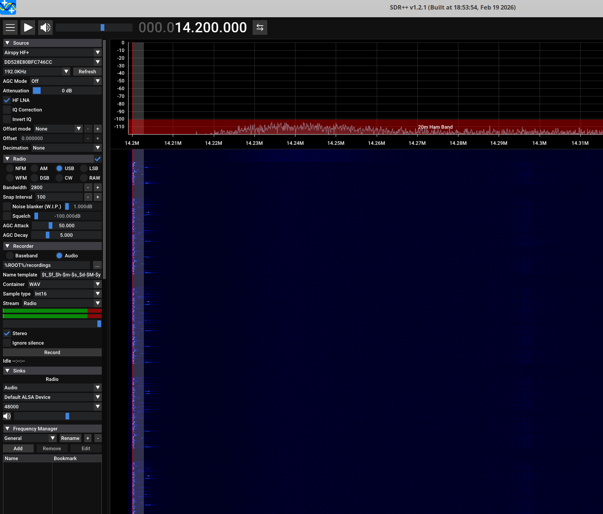
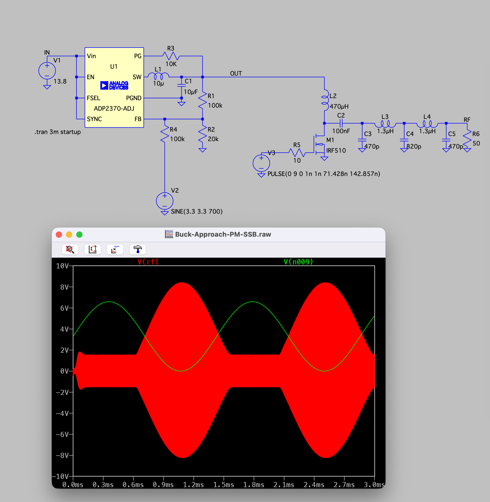
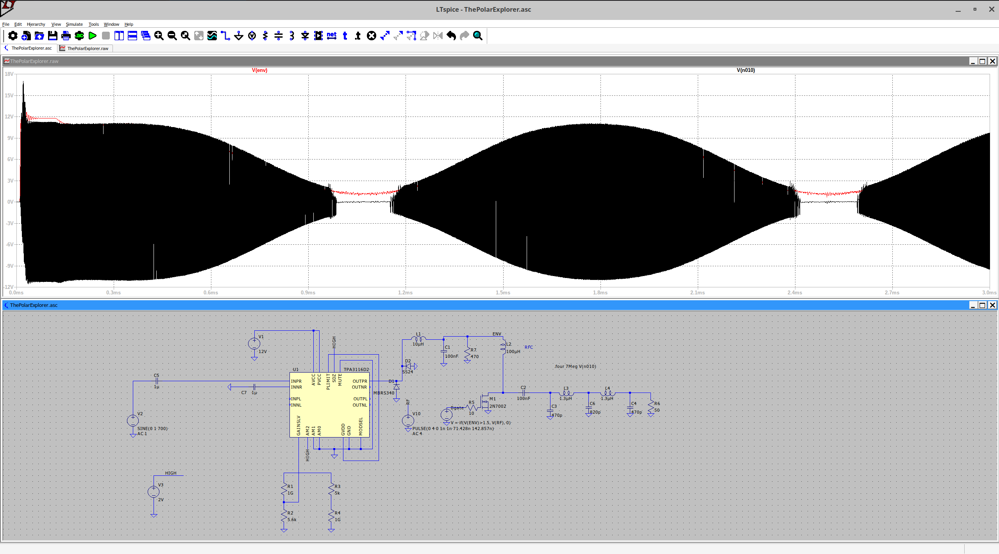

Experiments with SSB signal generation using `Polar Modulation`.

This documentation is pretty rough at the moment - please excuse!

This was inspired by https://dl0tz.de/polar/index_en.html work.

Hardware: RP2350-Zero MCU board + Fast Si5351 module with TCXO (included)!

Software: Run `make` from the `firmware_ssb` folder.

Demo:

Updates:

15-Feb-2026: The generated SSB signal's audio quality and fidelity is not good at all. This being said, one can still make out the original message if one squints hard enough. We only do phase modulation currently and are still building out the amplitude ("envelope") restoration hardware (the code for this is ready on Pin 0).

18-Feb-2026: The generated SSB signal's audio quality and fidelity is pretty ok'ish now! We are yet to hookup the envelope restoration ("AM") circuitry.
